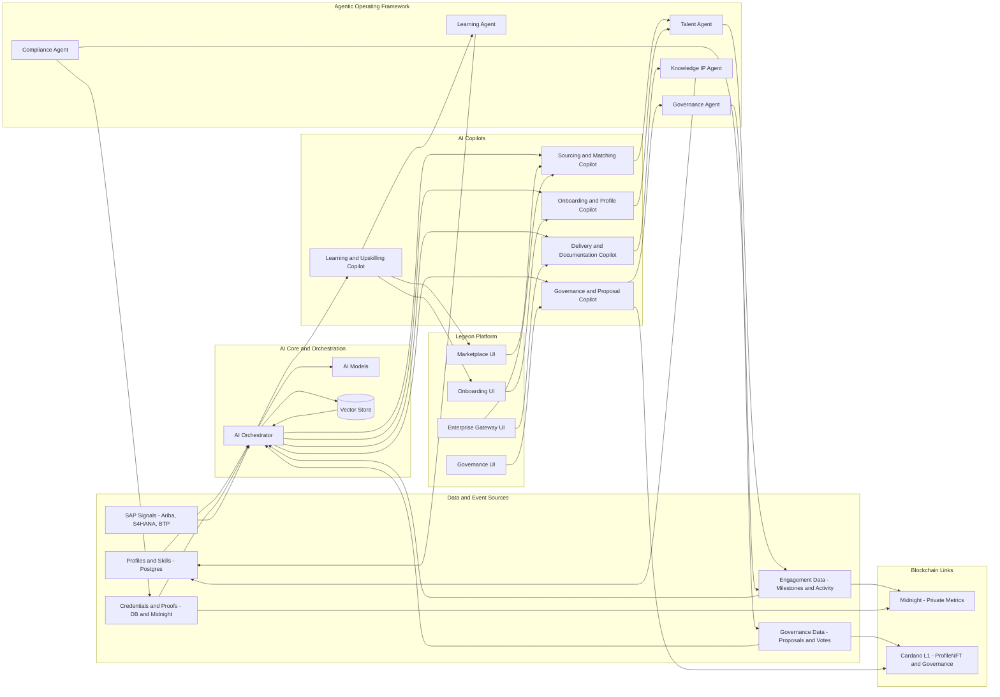

# Legeon AI and Agentic Operating Framework Architecture

```mermaid
flowchart LR
    %% Data and Event Sources
    subgraph SOURCES[Data and Event Sources]
        PROFILES[Profiles and Skills - Postgres]
        CREDS[Credentials and Proofs - DB and Midnight]
        ENGDATA[Engagement Data - Milestones and Activity]
        SAPDATA[SAP Signals - Ariba, S4HANA, BTP]
        GOVDATA[Governance Data - Proposals and Votes]
    end

    %% AI Core
    subgraph AICORE[AI Core and Orchestration]
        ORCH[AI Orchestrator]
        FM[AI Models]
        VEC[(Vector Store)]
    end

    PROFILES --> ORCH
    CREDS --> ORCH
    ENGDATA --> ORCH
    SAPDATA --> ORCH
    GOVDATA --> ORCH

    ORCH --> FM
    ORCH --> VEC
    VEC --> ORCH

    %% Copilots
    subgraph COPILOTS[AI Copilots]
        CP_ONB[Onboarding and Profile Copilot]
        CP_MATCH[Sourcing and Matching Copilot]
        CP_DELIV[Delivery and Documentation Copilot]
        CP_GOV[Governance and Proposal Copilot]
        CP_LEARN[Learning and Upskilling Copilot]
    end

    ORCH --> CP_ONB
    ORCH --> CP_MATCH
    ORCH --> CP_DELIV
    ORCH --> CP_GOV
    ORCH --> CP_LEARN

    %% Agentic Framework
    subgraph AGENTS[Agentic Operating Framework]
        AG_TALENT[Talent Agent]
        AG_COMP[Compliance Agent]
        AG_GOV[Governance Agent]
        AG_LEARN[Learning Agent]
        AG_IP[Knowledge IP Agent]
    end

    CP_MATCH --> AG_TALENT
    CP_ONB --> AG_TALENT
    CP_DELIV --> AG_IP
    CP_GOV --> AG_GOV
    CP_LEARN --> AG_LEARN

    AG_TALENT --> ENGDATA
    AG_COMP --> ENGDATA
    AG_COMP --> CREDS
    AG_GOV --> GOVDATA
    AG_LEARN --> PROFILES
    AG_IP --> PROFILES

    %% Platform UIs
    subgraph PLATFORM[Legeon Platform]
        FE_ONB[Onboarding UI]
        FE_MKT[Marketplace UI]
        FE_ENT[Enterprise Gateway UI]
        FE_GOV[Governance UI]
    end

    FE_ONB --> CP_ONB
    FE_MKT --> CP_MATCH
    FE_ENT --> CP_MATCH
    FE_ENT --> CP_DELIV
    FE_GOV --> CP_GOV

    CP_LEARN --> FE_ONB
    CP_LEARN --> FE_MKT

    %% Chain Links
    subgraph CHAIN[Blockchain Links]
        MID[Midnight - Private Metrics]
        CARD[Cardano L1 - ProfileNFT and Governance]
    end

    ENGDATA --> MID
    CREDS --> MID
    GOVDATA --> CARD
    CP_GOV --> CARD
```
