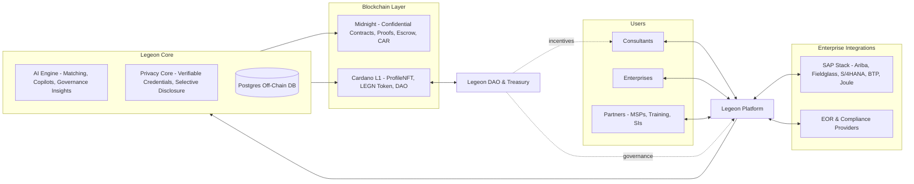

```mermaid
flowchart LR
    subgraph Users
        C[Consultants]
        E[Enterprises]
        P[Partners - MSPs, Training, SIs]
    end

    C <--> LP[Legeon Platform]
    E <--> LP
    P <--> LP

    subgraph Core[Legeon Core]
        AI[AI Engine - Matching, Copilots, Governance Insights]
        PRIV[Privacy Core - Verifiable Credentials, Selective Disclosure]
        DB[(Postgres Off-Chain DB)]
    end

    LP --> Core

    subgraph Chain[Blockchain Layer]
        M[Midnight - Confidential Contracts, Proofs, Escrow, CAR]
        ADA[Cardano L1 - ProfileNFT, LEGN Token, DAO]
    end

    Core --> M
    Core --> ADA

    subgraph Ent[Enterprise Integrations]
        SAP[SAP Stack - Ariba, Fieldglass, S/4HANA, BTP, Joule]
        EOR[EOR & Compliance Providers]
    end

    LP <--> SAP
    LP <--> EOR

    ADA <--> DAO[Legeon DAO & Treasury]
    DAO -. governance .-> LP
    DAO -. incentives .-> C
```
